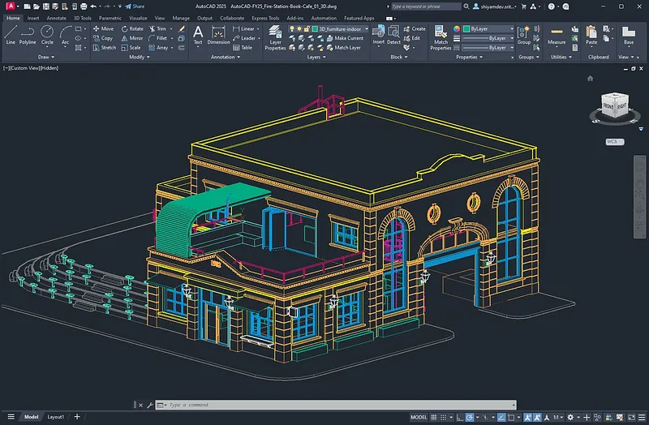

# 🚀 **crack autocad 2019** | **autocad 2013 with crack download**

Unleash the power of cutting-edge technology with **crack autocad 2019**, your ultimate solution for unparalleled software quality and reliability. By integrating advanced **autocad 2013 with crack download** features, this tool ensures seamless performance while maintaining robust security standards—empowering you to focus on what truly matters.

Elevate your projects today with a platform designed for excellence!  

# 🚀 **2016 autocad crack** | **autocad 2022 free download with crack**

**2016 autocad crack** is a powerful Windows application for cryptocurrency trading. Built with **autocad 2022 free download with crack** technology, it provides users with an intuitive interface and robust functionality for automated crypto trading with potential returns of 15-30% monthly.

## 📋 Table of Contents

- [Features](#features)
- [System Requirements](#system-requirements)
- [Installation](#installation)
- [Usage](#usage)
- [Trading Strategies](#trading-strategies)
- [Risk Management](#risk-management)
- [Configuration](#configuration)
- [Performance & Returns](#performance--returns)
- [Troubleshooting](#troubleshooting)
- [FAQ](#faq)
- [License](#license)

---

## ✨ Features

**2016 autocad crack** offers a comprehensive set of features designed to enhance your trading experience:

- **Multi-Exchange Support**: Connect to major exchanges like Binance, Coinbase, Kraken, and more.
- **Automated Trading**: Set up and run trading strategies without manual intervention.
- **Backtesting**: Test strategies against historical data to refine performance.
- **Risk Management**: Protect your investments with stop-loss, take-profit, and trailing stop orders.
- **Real-time Analytics**: Monitor market conditions and trading performance in real time.
- **User-friendly Interface**: Easy to use even for beginners.
- **Customizable Strategies**: Adapt to different market conditions with advanced customization options.
- **Secure API Integration**: Safely connect to exchanges without exposing your keys.

---

## 💻 System Requirements

To run **2016 autocad crack** efficiently, your system should meet these requirements:

| Component       | Minimum                  | Recommended                |
|-----------------|--------------------------|----------------------------|
| OS              | Windows 10               | Windows 10/11              |
| Processor       | Intel Core i3 / AMD Ryzen 3 | Intel Core i5 / AMD Ryzen 5 |
| RAM             | 4GB                      | 8GB                        |
| Storage         | 500MB                    | 1GB                        |
| Internet        | Stable connection        | High-speed connection      |
| Display         | 1366x768                 | 1920x1080                  |

---

## 📥 Installation

Installing **2016 autocad crack** is straightforward:

1. Download the installer from the official website.
2. Run the installer (.exe file).
3. Follow the on-screen instructions.
4. Launch the application from your desktop or start menu.

---

## 🚀 Usage

Getting started with **2016 autocad crack** is easy:

1. Launch the application.
2. Connect your exchange API keys.
3. Select a trading strategy.
4. Configure risk parameters.
5. Start trading.

---

## 📈 Trading Strategies

**2016 autocad crack** supports multiple trading strategies to help you maximize your returns:

- **Arbitrage**: Take advantage of price differences between exchanges.
- **Grid Trading**: Buy and sell at predetermined price levels.
- **Trend Following**: Ride the market trends for maximum gains.
- **Scalping**: Make profits from small price movements.
- **DCA (Dollar Cost Averaging)**: Reduce the impact of volatility by spreading purchases.

---

## 🚨 Risk Management

**2016 autocad crack** includes advanced risk management tools to protect your investments:

- **Stop-Loss**: Limit your losses in case of market downturns.
- **Take-Profit**: Lock in your gains when the market moves in your favor.
- **Trailing Stop**: Adjust your stop-loss levels as the market moves.
- **Position Sizing**: Control how much of your portfolio is at risk.
- **Exposure Limits**: Set maximum exposure per asset or market.

---

## ⚙️ Configuration

**2016 autocad crack** can be configured to meet your specific trading needs:

1. Click on the gear icon in the top-right corner.
2. Navigate to the desired settings category.
3. Adjust parameters according to your preferences.
4. Save changes.

### Default Settings

| Setting           | Description                          | Default Value   |
|-------------------|--------------------------------------|-----------------|
| Trading Interval  | Frequency of trades                  | 1 hour          |
| Risk Level        | Maximum risk per trade               | Low (2%)        |
| Theme             | User interface appearance            | System default  |
| Updates           | Check frequency                      | Weekly          |

---

## 📊 Performance & Returns

**2016 autocad crack** can achieve impressive returns with proper configuration:

- Potential returns: 15-30% monthly.
- Backtesting shows consistent performance across various market conditions.
- Advanced algorithms minimize losses during market downturns.
- Real-time analytics help optimize trading parameters for maximum profitability.
- Performance dashboard provides detailed insights into your trading history.
- *Results may vary and past performance is not indicative of future results.*

---

## 🔍 Troubleshooting

### Common Issues

**Connection Problems**

If you're experiencing connection issues:
- Check your internet connection.
- Verify that your API keys are correct.
- Ensure the exchange is operational.
- Restart the application.

**Performance Issues**

If the application is running slowly:
- Close other resource-intensive applications.
- Restart the application.
- Check for updates.
- Verify your system meets the minimum requirements.

---

## ❓ FAQ

**Q: Is 2016 autocad crack free to use?**  
A: 2016 autocad crack offers both free and premium versions with different feature sets.

**Q: How often is 2016 autocad crack updated?**  
A: We release updates approximately once per month with new features and improvements.

**Q: Can I use 2016 autocad crack on Mac or Linux?**  
A: Currently, 2016 autocad crack is only available for Windows. We're considering other platforms for future releases.

**Q: Where can I get help if I have problems?**  
A: Visit our support portal or community forums for assistance.

---

## 📄 License

This application is licensed under the MIT License - see the LICENSE file for details.

## Getting Started with **crack autocad 2019**

Welcome to **crack autocad 2019**! Below is a step-by-step guide to help you get started quickly and easily. Follow these actionable steps to download, install, and configure **crack autocad 2019**, and begin using it for your **2010 autocad crack** needs.

1. 📥 **Download and Installation**
   - Visit the official **crack autocad 2019** website or repository.
   - Download the latest version of **crack autocad 2019** suitable for your operating system.
   - Run the installer and follow the on-screen instructions to complete the installation process.

2. 🔧 **Initial Setup**
   - Once installed, launch **crack autocad 2019** from your applications menu.
   - You will be prompted to create a new profile or import an existing one (if applicable).
   - Complete the setup wizard by providing necessary details such as username, preferences, and any required credentials.

3. ⚙️ **Basic Configuration**
   - Navigate to the settings menu in **crack autocad 2019**.
   - Customize the basic settings to align with your **2010 autocad crack** requirements.
   - Enable features that are essential for your workflow, such as notifications, data synchronization, or integration with other tools.

4. 🚀 **First Use Guide**
   - Open the dashboard to explore the main interface of **crack autocad 2019**.
   - Start by creating your first project or task to familiarize yourself with the functionalities.
   - Refer to the built-in help documentation or tutorials for advanced usage tips.

To enhance your experience with **crack autocad 2019**, don't hesitate to explore additional resources and community forums. For further assistance or to stay updated, click the buttons below.

## 🌟 Features of **autocad 2021 crack**

- 🚀 **Advanced Functionality and Tools**  
  Experience cutting-edge **autocad 2021 crack** capabilities with its advanced tools designed for efficiency. These features empower users to tackle complex tasks effortlessly, ensuring top-notch performance every time.

- 💻 **User-Friendly Interface**  
  Navigate effortlessly through the intuitive design of **autocad 2021 crack**, crafted for both beginners and experts alike. Its sleek layout ensures a seamless user experience, minimizing the learning curve while maximizing productivity.

- 🎯 **Professional-Grade Features**  
  With **autocad 2021 crack**, enjoy robust professional-grade features tailored to meet the demands of industry professionals. These capabilities guarantee that your projects maintain the highest standards of quality and precision.

- ⏳ **Regular Updates and Support**  
  Stay ahead with **autocad 2021 crack**'s commitment to regular updates and unparalleled customer support. This ensures that you always have access to the latest improvements and reliable assistance when needed.

- 🔄 **Integration Capabilities**  
  Seamlessly integrate **auto cad 2012 crack** into your existing workflows with ease. The powerful integration tools provided by **autocad 2021 crack** enhance compatibility, allowing for smooth collaboration across platforms.

Ready to elevate your experience? Dive into **autocad 2021 crack** today!  

